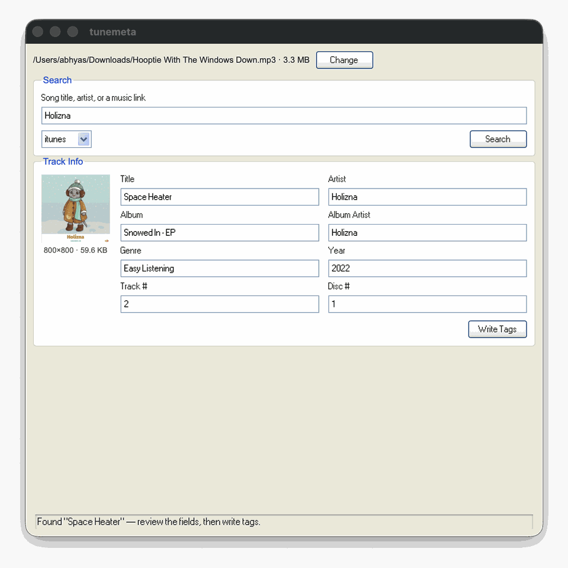

# tunemeta

[](https://github.com/AbhyasKanaujia/tunemeta/actions/workflows/ci.yml)
[](LICENSE)

Look up clean, accurate ID3 metadata and cover art for a song — by URL, ID,
or just a search — and write it straight into your MP3s. Desktop app for
macOS/Windows/Linux, or a CLI if you'd rather script it.

Born out of a real annoyance: MP3s downloaded from random sites often carry
garbage tags (`Artist: SomeChannel - Topic`, blank comments, low-res or
oversized cover art). `tunemeta` looks the track up against a real catalog
and fixes it in one step.



## Download

| Platform | |
|---|---|
| macOS | [tunemeta-macos.dmg](https://github.com/AbhyasKanaujia/tunemeta/releases/latest/download/tunemeta-macos.dmg) |
| Windows | [tunemeta-windows.exe](https://github.com/AbhyasKanaujia/tunemeta/releases/latest/download/tunemeta-windows.exe) |
| Linux | [tunemeta-linux](https://github.com/AbhyasKanaujia/tunemeta/releases/latest/download/tunemeta-linux) (needs GTK3 + WebKit2GTK, already on most desktop distros; `chmod +x` before running) |

No install step, no Python required. See the [latest release](https://github.com/AbhyasKanaujia/tunemeta/releases/latest) for the changelog.

## Features

- Look up a track by URL, iTunes ID, or free-text search — get back cleaned-up title, artist, album, genre, year, and cover art.
- Write it straight into an MP3's ID3 tags, cover art included, resized sensibly (never upscaled, capped at a sane size) instead of bloating the file.
- Shows what's already tagged on a file before you overwrite it.
- Same thing available as a scriptable CLI.

## Command line

Not on PyPI yet — install straight from GitHub:

```
pip install git+https://github.com/AbhyasKanaujia/tunemeta.git
```

**Print cleaned-up metadata as JSON:**

```
tunemeta info <url-or-id-or-search-text>
```

**Download cover art:**

```
tunemeta art <url-or-id-or-search-text> -o cover.jpg --size 1000
```

**Tag a local MP3 file directly** (looks the track up, writes ID3 tags and
embeds resized cover art in one step):

```
tunemeta tag song.mp3 <url-or-id-or-search-text>
```

Run `tunemeta <command> --help` for all options (artwork size, skipping
cover art, choosing a provider). To run the desktop app from source instead
of downloading a build: `pip install -e ".[gui]"` then `tunemeta-gui`.

Example output:

```
$ tunemeta info "https://music.apple.com/us/song/example-track/000000000"
{
  "title": "Example Track",
  "artist": "Example Artist",
  "album": "Example Album",
  "album_artist": "Example Artist",
  "genre": "Pop",
  "year": 2024,
  ...
  "artwork_url": "https://.../1000x1000bb.jpg"
}
```

## Why not just embed the biggest cover art available?

Source artwork can be 3000x3000 or larger. Embedding it as-is can more than
double the size of a typical MP3 for no perceptible benefit in a player UI.
`tunemeta` re-encodes to a sensible size (800px by default when tagging) and
never upscales past the source's native resolution.

## Design

Metadata comes from pluggable **providers** (`src/tunemeta/providers/`).
Each provider implements a small interface — `lookup(identifier)` and
`artwork_url(metadata, size)` — so adding a new source doesn't touch the CLI
or tagging code. Only one ships today:

- **iTunes** — Apple's public, unauthenticated Search/Lookup API.

## Roadmap

- [x] iTunes provider
- [x] Desktop app (macOS/Windows/Linux)
- [ ] MusicBrainz + Cover Art Archive provider (fully open, no API key)
- [ ] Deezer provider
- [ ] Last.fm provider (genre/tag data)
- [ ] `--provider` fallback chain (try multiple sources, take the first hit)
- [ ] Batch mode (tag a whole folder at once)

## Feature requests & bugs

- [Request a feature](https://github.com/AbhyasKanaujia/tunemeta/issues/new?template=feature_request.yml)
- [Report a bug](https://github.com/AbhyasKanaujia/tunemeta/issues/new?template=bug_report.yml)

## Contributing

See [CONTRIBUTING.md](CONTRIBUTING.md) — the provider interface in
`src/tunemeta/providers/base.py` is the easiest place to start (a new
metadata source is a new file plus one line in `providers/__init__.py`).

## License

MIT — see [LICENSE](LICENSE).
